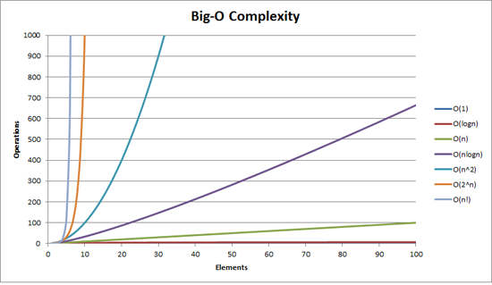

# 03/19 스터디 발표

날짜: 2025년 3월 19일

---

<aside>
💡

책이랑 달리 Java 기준으로 설명

</aside>

# 1. 자료 구조

- 효율적으로 데이터를 관리하고 수정, 삭제, 탐색, 저장할 수 있는 데이터 집합

## 1-1. 자료 구조에서의 시간 복잡도

- 데이터의 양이 방대할수록 이를 처리하는 자료 구조가 중요해짐
    - 삽입과 삭제가 잦은가? → 연결 리스트
    - 탐색이 잦은가? → 배열

### 시간 복잡도란?

- 입력 크기에 대해 어떠한 알고리즘이 실행되는 데 걸리는 시간
- 주요 로직의 반복 횟수를 중점으로 측정
    - 가장 영향을 많이 끼치는 항의 상수 인자와 나머지 항을 뻄
    
    ```java
    main() {
    		List list;
    	
    		Arrays.sort(list);  // O(nlogn)
    		
    		for (i = 0; i < list.size; i++)  // O(n^2)
    			for (j = 0; j < list.size; j++)
    
    		Arrays.sort(list);  // O(nlogn)
    }
    ```
    
    - O(2nlogn + n^2) → O(n^2)



- 왜 계산해야 하는가?
    - 입력 크기가 커짐에 따라 속도의 차이가 확연히 벌어짐

## 1-2. 자료 구조의 평균 시간 복잡도

| 자료 구조 | 접근 | 탐색 | 삽입 | 삭제 |
| --- | --- | --- | --- | --- |
| 배열 | O(1) | O(n) | O(n) | O(n) |
| 스택 | O(n) | O(n) | O(1) | O(1) |
| 큐 | O(n) | O(n) | O(1) | O(1) |
| 이중 연결 리스트 | O(n) | O(n) | O(1) | O(1) |
| 해시 테이블 | O(1) | O(1) | O(1) | O(1) |
| 이진 탐색 트리 | O(logn) | O(logn) | O(logn) | O(logn) |
| AVL 트리 | O(logn) | O(logn) | O(logn) | O(logn) |
| 레드 블랙 트리 | O(logn) | O(logn) | O(logn) | O(logn) |
- 크게 선형 자료 구조와 비선형 자료 구조로 분류 가능

### 선형 자료 구조

- 배열, 스택, 큐, 이중 연결 리스트
- 요소가 연속적으로 배치되어 있어, 탐색 시 전체를 순회해야 하는 경우가 많음

### 비선형 자료 구조

- 트리 계열 (이진 탐색 트리, AVL 트리, 레드 블랙 트리)
- 요소 간의 관계가 계층적이거나, 해시 함수를 통해 관리되어 탐색 및 삽입이 효율적

## 1-3. 자료 구조의 최악의 시간 복잡도

| 자료 구조 | 접근 | 탐색 | 삽입 | 삭제 |
| --- | --- | --- | --- | --- |
| 배열 | O(1) | O(n) | O(n) | O(n) |
| 스택 | O(n) | O(n) | O(1) | O(1) |
| 큐 | O(n) | O(n) | O(1) | O(1) |
| 이중 연결 리스트 | O(n) | O(n) | O(1) | O(1) |
| 해시 테이블 | O(n) | O(n) | O(n) | O(n) |
| 이진 탐색 트리 | O(n) | O(n) | O(n) | O(n) |
| AVL 트리 | O(logn) | O(logn) | O(logn) | O(logn) |
- 해시 테이블
    - Key, Value의 쌍으로 데이터 저장
    - O(1): 해시 함수를 통해 인덱스 계산
    - O(n): 해시 충돌이 많이 발생하면 성능 저하 발생
        - 해시 충돌이란?
            - 다른 키들이 해시 함수를 돌렸는데 값이 동일해지는 경우 발생
            - 해당 해시 값의 데이터를 연결 리스트로 관리
            - 충돌 발생할 때 끝에 데이터 추가
- 이진 탐색 트리
    - O(1): 트리가 균형 잡혀 있다면 효율적
    - O(n): 한쪽으로 치우친 경우 연결 리스트와 유사
- AVL, 레드 블랙 트리
    - AVL: 왼쪽과 오른쪽의 높이 차이로 균형을 유지하는 트리
    - 레드-블랙: 노드를 빨강과 검정으로 구분, 색상으로 균형을 유지하는 트리
    - O(logn): 균형을 유지하는 트리이므로 안정적 성능

---

# 2. 선형 자료 구조

- 요소가 일렬로 나열되어 있는 자료 구조로, 데이터가 순차적으로 배치됨
- 접근 방식에 따라 순차적 접근과 임의 접근으로 나뉨

## 2-1. 연결 리스트


- 데이터를 담은 노드들이 포인터로 연결된 구조
- 배열과 달리 크기가 고정되어 있지 않아 동적으로 크기 조절이 가능함
- 삽입과 삭제는 O(1)로 빠르지만, 탐색은 O(n)이 소요됨

### 종류

- **단일 연결 리스트:** 다음 노드를 가리키는 포인터(`next`)만 가짐
- **이중 연결 리스트:** 이전 노드(`prev`)와 다음 노드(`next`)를 가리키는 포인터를 가짐
- **원형 연결 리스트:** 마지막 노드의 `next`가 첫 번째 노드를 가리켜 원형을 이루는 형태

### 이중 연결 리스트

- 자바에서의 구현은 `LinkedList`로 제공됨
- 중간 노드 삭제 시, 포인터만 수정하면 되므로 효율적
- 단방향 연결 리스트에 비해 메모리 사용량이 많음

### 주요 메서드

- 삽입: `addFirst()`, `addLast()`, `add(index, element)`
- 삭제: `removeFirst()`, `removeLast()`, `remove(index)`
- 탐색: `get(index)`, `contains(element)`

## 2-2. 배열


- 같은 타입의 변수들로 이루어진 자료 구조로, 크기가 고정됨
- 인접한 메모리 위치에 요소들이 연속적으로 저장됨
- 인덱스를 통해 O(1)로 접근 가능하지만, 삽입과 삭제는 O(n)의 시간이 소요됨

### 특징

- 같은 타입의 변수들로 이루어져 있음
- 크기가 정해져 있음 (고정)
- 인접한 메모리 위치에 있는 데이터를 모아놓은 집합
    - 메모리 주소부터 자료 크기 * 자료 개수만큼 이어져 있음
- 접근에 O(1)의 시간이 걸림
    - 이유
- 랜덤 접근이 가능
    - 인덱스로 접근
- 중간 삽입과 삭제에는 O(n)이 걸림
    - 중간에 삽입을 할 때 데이터를 쭉 미는 작업이 필요
    - 마찬가지로 삭제를 하면 데이터를 쭉 당기는 작업이 필요

### 사용 방법

- Java에서 배열 선언: `int[] arr = new int[5];`

## 2-3. 벡터


- 동적 배열로, 배열의 크기를 자동으로 조절함
- 자바에서는 `Vector` 클래스로 제공되지만, 현재는 `ArrayList`가 더 많이 사용됨

### 특징

- 순차적 접근과 랜덤 접근 모두 가능
- 마지막 요소에 삽입/삭제는 평균적으로 O(1)의 시간 복잡도 (Amortized O(1))
    - **Amortized O(1) 설명:**
        - 벡터의 크기를 초과하여 삽입하면, 새로운 배열을 생성하고 기존 데이터를 복사함. 이때 데이터 복사에는 O(n)의 시간이 소요됨
        - 하지만 크기를 두 배로 늘려 삽입하므로, 전체적인 연산에서 이 복사 비용은 분산되어 삽입당 평균적으로 O(1)에 수렴함
        - 즉, 대부분의 삽입은 O(1)이지만, 드물게 O(n)이 발생함으로 이를 평균적으로 Amortized O(1)이라고 함
- 중간 요소의 삽입/삭제는 O(n)의 시간 복잡도를 가짐

### 사용 방법

- 자바에서 벡터 선언: `Vector<Integer> vector = new Vector<>();`

## 2-4. 스택


- LIFO(Last In, First Out) 구조로, 마지막에 삽입된 데이터가 먼저 삭제됨
- 함수 호출의 **재귀적 구조**, 컴파일러의 **함수 호출 스택**, **괄호 검사** 등에 사용됨

### 특징

- 삽입과 삭제는 O(1)로 빠름
- 탐색은 O(n)으로 느림

### 사용 방법

- 삽입: `push()`
- 삭제: `pop()`
- 조회: `peek()`

## 2-5. 큐


- FIFO(First In, First Out) 구조로, 먼저 삽입된 데이터가 먼저 삭제됨
- **운영체제의 프로세스 관리**, **네트워크 데이터 처리**, **BFS 탐색** 등에 사용

### 특징

- 삽입과 삭제는 O(1)로 효율적
- 탐색은 O(n)으로 느림

### 사용 방법

- 삽입: `offer()`, `add()`
- 삭제: `poll()`, `remove()`
- 조회: `peek()`, `element()`